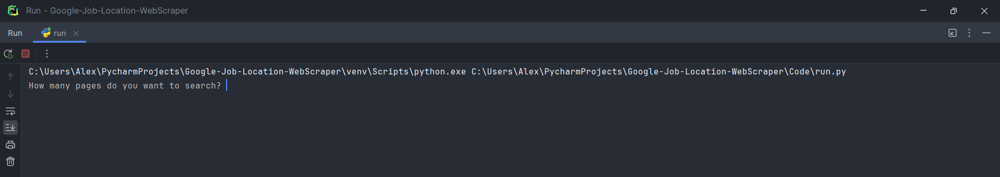
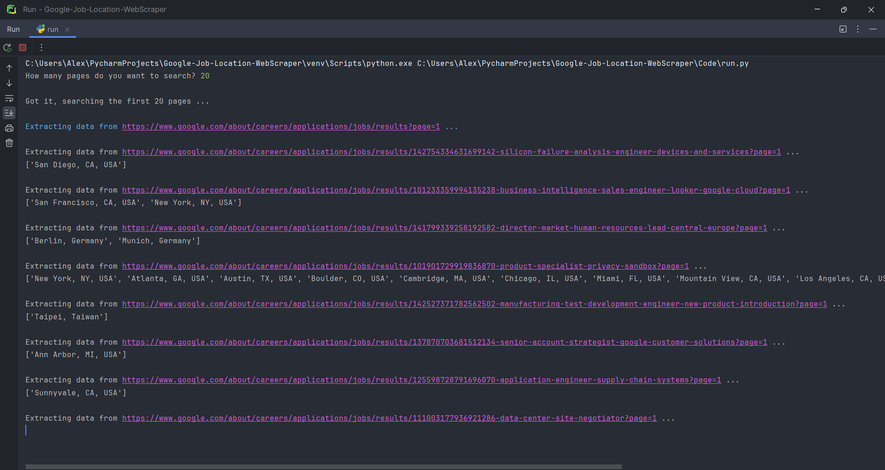
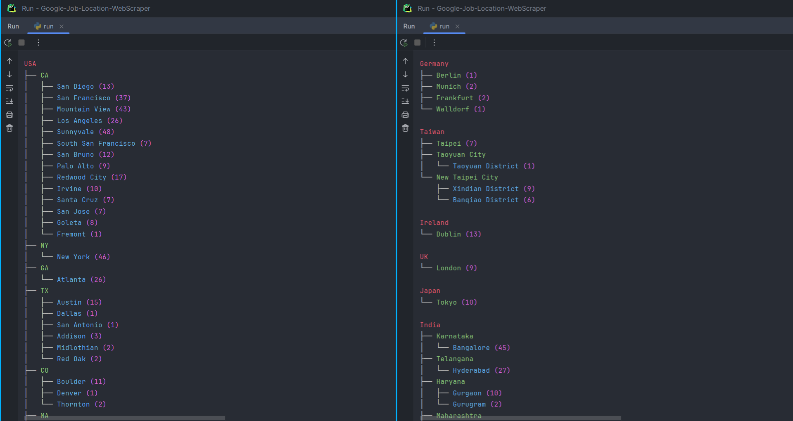

## Google Job Location WebScraper
Extracts location data and presents it in a tree structure

<h6>Note: Only extracts data for in-office locations, it should discard all remote locations like ["USA"] and ["India"]<h6>
<h6>This is done for data consistency reasons since in-office data is in the format ["Los Angeles", "CA", "USA"]</h6>
  
## Description
```python
"""
---
Searches a specified number of pages (20 jobs per page)
---
Extracts location data and presents it in a tree structure
---
"""
```
## Requirements
```
Python 3.12 and above
```
```
Python packages listed in requirements.txt
```
## How the program should behave
```
When we start run.py it should ask the number of pages to extract data from
```

```
After receiving appropriate input it should then start extracting location data
```

```
After all data has been extracted it should present it in a tree structure
```

